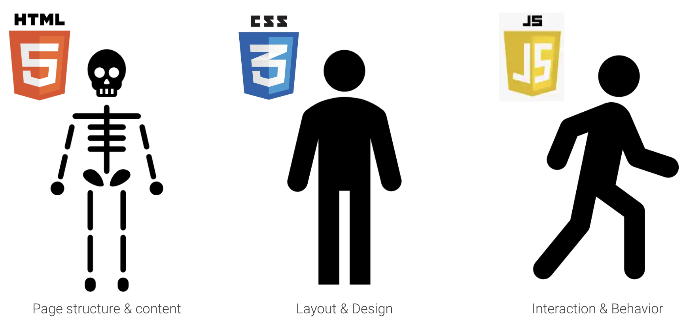
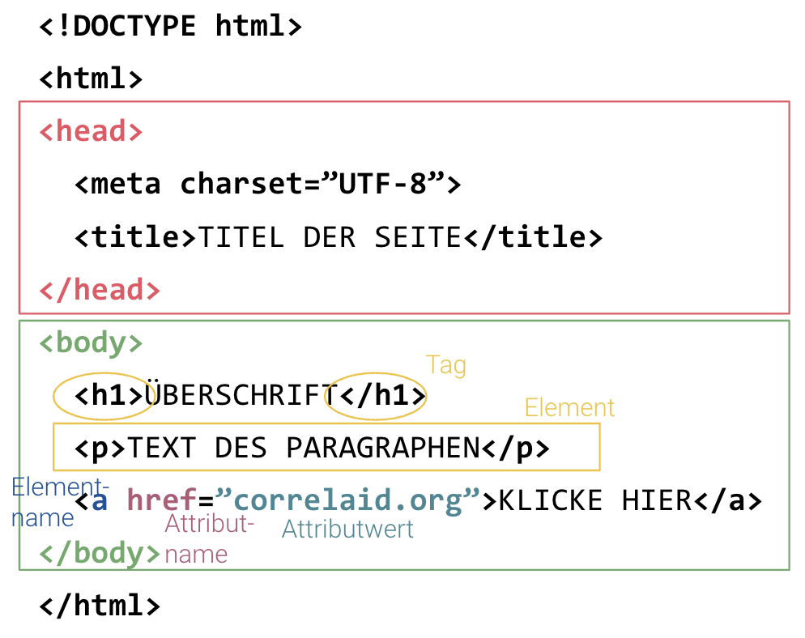
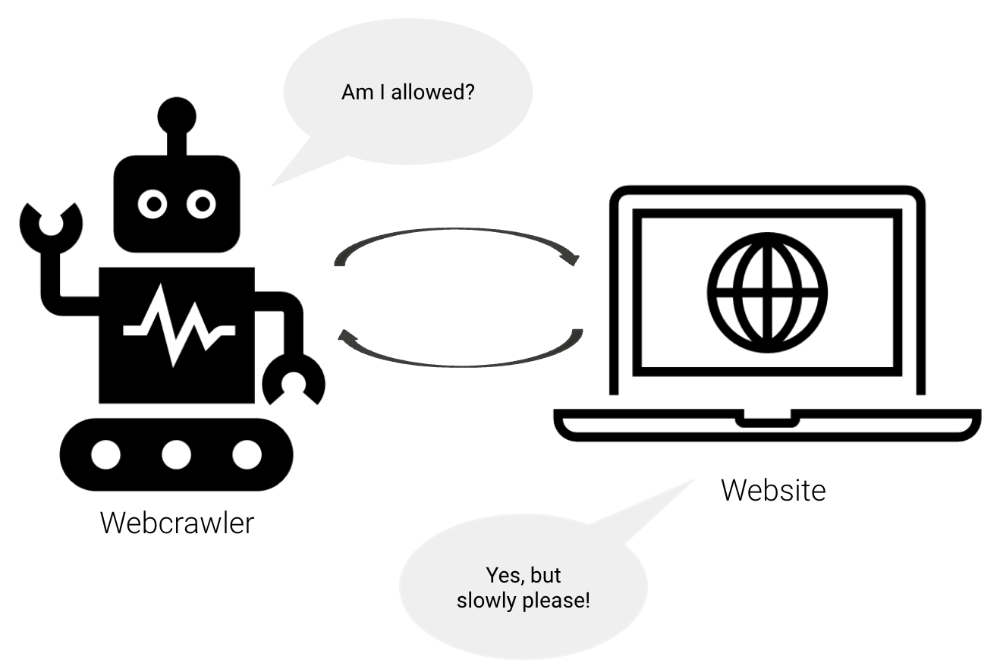
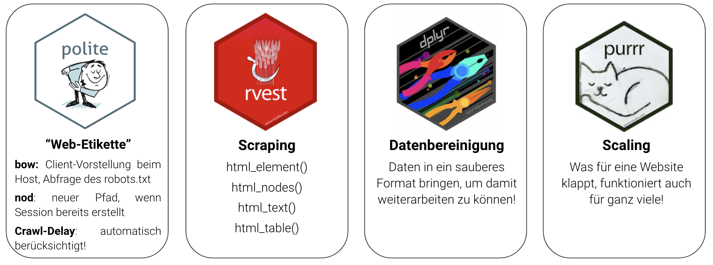

```{r setup, include=FALSE}
knitr::opts_chunk$set(echo = TRUE)
library(dplyr)
library(knitr)
library(forcats)
library(countrycode)
library(tidyr)
library(ggplot2)
```

# Intro

## Agenda
1. Web Data Collection 
2. Struktur von **HTMLs** 
3. Informationen mit **XPaths** extrahieren
4. **"Web Etiquette"** & robots.txt
5. **Hands-On**: Eine Website scrapen

# Bevor wir loslegen - Setup

## Setup & Installation
- Ihr solltet R und RStudio installiert haben!
- Ladet das Repo herunter oder cloned es euch: `https://github.com/CorrelAid/community-workshop-webscraping/`
- Mit diesem Code könnt ihr die Packages installieren: 

```{r, eval = FALSE}
source(knitr::purl('code/packages.Rmd', quiet = TRUE))
```

# Ein wenig Theorie | Web Data Collection

## Warum?

## Warum?
<blockquote>
**Web Scraping** = Sammeln von Informationen von Websites durch das Extrahieren von Text direkt aus dem HTML Code
</blockquote>

- Daten über Daten
- Kein Copy & Paste mehr
- Automatisierung der Datensammlung
- Reproduzierbare und aktualisierbare Datensammlung

## Woraus bestehen Websites?

## Woraus bestehen Websites?

{width=80%}

## HTML (1)

- **H**ypertext **M**arkup **L**anguage
- Anweisungen an den Browser, was wann und wo **dargestellt** werden soll
- Für Web Scraping: Wir müssen HTML nicht schreiben können, aber die Struktur zu verstehen hilft sehr!
- Hierarchische Baum-Struktur
- Tags mit Attributen

## HTML (2)

{width=60% height=100%}

## HTML (2)

| Tag                               | Description                    |
|-----------------------------------|--------------------------------|
| `<a href=""></a>`                 | Link / URL                     |
| `<div>` and `<span>`              | Blocks to structure the page   |
| `<p></p>`                         | Paragraph                      |
| `<h1>`, `<h2>`,...                | Headers                        |
| `<ul>`, `<ol>`, `<dl>`            | Lists                          |
| `<li></li>`                       | Single list element            |
| `<br>`                            | Line break                     |
| `<b>`, `<i>`, `<strong>`          | Layout options                 |
| `<table>`, `<th>`, `<td>`, `<tr>` | Tables                         |
| `<script></script>`               | Script container               |

## XPath
- **X**ML **Path** Language
- **Abfragesprache** zum Extrahieren von Teilen von HTML/XML-Dateien
- Nutzt Tags, Attribute und Beziehungen zwischen **Nodes** und Tags
- Basiert auf **hierarchischer Struktur** der Nodes
- Absolute Pfade: '/html/body/div/p'
- Relative Pfade: '//p'

## robots.txt
- **Robots Exclusion Standard**
- Nachricht an (Suchmaschinen-)Crawler über Zugriff auf URLs
- Ziel: Vermeidung des Zusammenbruchs einer Website aufgrund zu vieler gleichzeitiger Anfragen 
- Definition eines **Crawl-Delay** (z.B. 5 Sek)
<br>
{width=50%}

## Web Scraping mit R - Packages 
{width=100%}

# Hands-On | Web Scraping Workflow in R

## Website

$\longrightarrow$ URL der Website finden, die ihr scrapen wollt

```{r, results = 'hide'}
base_url <- 'https://www.bertelsmann-stiftung.de/'
projects_url <- 'https://www.bertelsmann-stiftung.de/en/our-projects/project-search?page=1'
```

## Seid nett! (1)

$\longrightarrow$ Sagt der Website, wer ihr seid!<br>
$\longrightarrow$ Checkt, ob ihr die Website scrapen dürft!<br>

```{r, results = 'hide'}
polite::bow(url = stringr::str_c(base_url), 
            user_agent = 'Workshop Web Data Collection - zoe.w@correlaid.org') -> session
```

```{r echo = FALSE}
session
```

## Seid nett! (2)

```{r, results = 'hide'}
# session
# session$robotstxt
# session$robotstxt$permissions
# session$robotstxt$crawl_delay
```

$\longrightarrow$ Habt ihr die **Erlaubnis** zum Scrapen? <br>
$\longrightarrow$ Welches **Crawl-Delay** ist für die Website vorgegeben? <br>
$\longrightarrow$ Gibt es bestimmte **Regeln** für einige Bots? <br>

## HTMLs herunterladen (1)

1 - HTML Seite laden (als Liste von `<head>` und `<body>`) in R:

```{r, results = 'hide'}
# call the session you created
session %>% 
  # be polite & specify url path
  polite::nod(stringr::str_c('en/our-projects/project-search?page=1')) %>%
  # scrape!
  polite::scrape() -> projects_html
```

## HTMLs herunterladen (2)

2 - Best practice: HTMLs herunterladen und lokal speichern:

```{r, results = 'hide'}
# create directory to store the htmls
if (!dir.exists(here::here('assets', 'htmls'))) {
  dir.create(here::here('assets', 'htmls'))
}
# function to download htmls
download_html <- function(url, filename) {
  polite::nod(session, url) %>%
    polite::rip(destfile = filename,
                path = here::here('assets', 'htmls'),
                overwrite = TRUE)
  }
# call function to download html
download_html(stringr::str_c(base_url, 'en/our-projects/project-search?page=1'),
              'projects.html')
```


## XPath: Daten extrahieren (1)
$\longrightarrow$ Rechtsklick auf der Website $\rightarrow$ Untersuchen / Inspect $\rightarrow$  nach HTML node suchen <br>
$\longrightarrow$ [Selector Gadget](https://selectorgadget.com/): "SelectorGadget is an open source tool that makes CSS selector generation and discovery on complicated sites a breeze" <br>
$\longrightarrow$ Könnt ihr den XPath zum ersten Projekt auf der Website finden?

## XPath: Daten extrahieren (2)
//*[@id="c199640"]/div[2]/div/div[2]/div[2]/div[2]/<br>
div/div/div[**1**]/article/div[2]/div/div[2]/h2/a <br>

//*[@id="c199640"]/div[2]/div/div[2]/div[2]/div[2]/<br>
div/div/div[**2**]/article/div[2]/div/div[2]/h2/a

Jetzt wird der Titel des ersten Projekts gesucht: 

```{r}
projects_html %>%
  rvest::html_element(xpath = '//*[@id="c199640"]/div[2]/div/div[2]/div[2]/div[2]/
                               div/div/div[1]/article/div[2]/div/div[2]/h2/a') %>%
  rvest::html_text2()
```

## XPath: Daten extrahieren (3)

An welche Daten kommen wir noch?

```{r}
# url to project
projects_html %>%
  rvest::html_element(xpath = '//*[@id="c199640"]/div[2]/div/div[2]/div[2]/div[2]/
                               div/div/div[1]/article/div[2]/div/div[2]/h2/a') %>%
  rvest::html_attr('href')

# project description
projects_html %>%
  rvest::html_element(xpath = '//*[@id="c199640"]/div[2]/div/div[2]/div[2]/div[2]/
                               div/div/div[2]/article/div[2]/div/div[3]/div/p') %>%
  rvest::html_text2()
```

## Data Cleaning

Vor dem Bereinigen: Wir benötigen ein Data Frame!

```{r}
data.frame(
  project = projects_html %>%
    rvest::html_nodes(xpath = '//*[@id="c199640"]/div[2]/div/div[2]/div[2]/div[2]/
                               div/div/div[*]/article/div[2]/div/div[2]/h2/a') %>%
    rvest::html_text2(),
  text = projects_html %>%
    rvest::html_nodes(xpath = '//*[@id="c199640"]/div[2]/div/div[2]/div[2]/div[2]/
                               div/div/div[*]/article/div[2]/div/div[3]/div/p') %>%
    rvest::html_text2()
) -> df
```

## Data Cleaning

Vor dem Bereinigen: Wir benötigen ein Data Frame!

```{r}
df %>%
  summary()
```

## Daten speichern

Weil ihr euer Scraping Script nicht vor jeder Analyse neu laufen lassen wollt:

```{r}
saveRDS(df, file = here::here('data', 'projects.RDS'))
```

# Scraping at Scale

## Sraping at Scale (1)

- https://www.bertelsmann-stiftung.de/en/our-projects/project-search?page=1
- https://www.bertelsmann-stiftung.de/en/our-projects/project-search?page=2

```{r}
# define base URL
base_url <- 'https://www.bertelsmann-stiftung.de/'

# Be polite
session <- polite::bow(url = base_url,
                       user_agent = 'Workshop Web Data Collection - zoe.w@correlaid.org')

# Vektor to define all pages we want to have a look at
pages <- 1:7
```

## Sraping at Scale (2)

1 - Ladet ALLE HTML Seiten in R:

```{r}
# With purrr you can map over all numbers in the vector "pages"
purrr::map(.x = pages, ~ {
  #...you create the url for each of the pages...
  polite::nod(session, stringr::str_c('en/our-projects/project-search?page=', .x)) %>%
  #...and scrape the htmls!
    polite::scrape()
}) -> results
```

## Sraping at Scale (3)

2 - Best practice: Ladet alle HTMLs herunter und speichert sie lokal:

```{r, results = 'hide'}
# With purrr you can map over all numbers in the vector "pages"
purrr::map(.x = pages, ~ {
  #...you create the url for each of the pages...
  polite::nod(session, stringr::str_c('en/our-projects/project-search?page=', .x)) %>%
  #...and save!
    polite::rip(destfile = stringr::str_c('projects_', .x, '.html'),
                path = here::here('assets', 'htmls'),
                overwrite = TRUE)
})
```

## Scraping at Scale (4)

Erstellt einen Datensatz mit ALLEN Projekten:

```{r}
purrr::map_dfr(.x = results, ~ {
  data.frame(
  project = .x %>%
    rvest::html_nodes(xpath = '//*[@id="c199640"]/div[2]/div/div[2]/div[2]/div[2]/
                               div/div/div[*]/article/div[2]/div/div[2]/h2/a') %>%
    rvest::html_text2(),
  text = .x %>%
    rvest::html_nodes(xpath = '//*[@id="c199640"]/div[2]/div/div[2]/div[2]/div[2]/
                               div/div/div[*]/article/div[2]/div/div[3]/div/p') %>%
    rvest::html_text2()
  )
}) -> all_events
```

# Danke! | Bei Fragen meldet euch gerne bei zoe.w@correlaid.org! 
